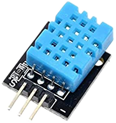
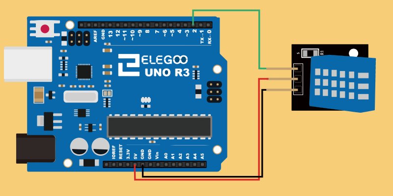

# Arduino - Sense and send

[[toc]] 
The end devices, in our project, is represented by a set of Arduino Uno.

The Arduino should sense the room Temperature and Humidity and send it, through serial, on the EDGE device (the Raspberry PI).

To write and flash the firmware for the Arduino, I used the [Arduino IDE](https://www.arduino.cc/en/software).


## Sense
For the temperature and humidity sensor will be used the DHT11 sensor.




### Wiring



About the wiring, the sensor has 3 pins: 
- Signal;
- Ground;
- 5 voltage;

Is simple to connect them to the Arduino.

### Code

This sensor is capable to measure both Temperature and Humidity.
The library used for implementing the software for this sensor is the one given by adafruit: [DHT-sensor-library](https://github.com/adafruit/DHT-sensor-library).

After including the library, with two simple instruction (and some control on them) the game is done. 

``` cpp
float h = dht.readHumidity();
float t = dht.readTemperature();
```
## Communication
As I said before, the Arduinos should communicate with the edge server (that will be a Raspberry PI).
The serial port will be the protocol used in this process.

The Arduino must be capable to receive a request of data (for instance _getTempAndHumidity_ - this will be syncronized with the EdgeDevices team) and to response with the Temperature and Humidity value.


``` cpp
String command;
...

if (Serial.available()) {
    command = Serial.readStringUntil('\n');
    
    
    if (command.equals("getTempAndHumidity")) {
      h = measureHumidity();
      t = measureTemperature();
      Serial.println("sendMessage command");
      Serial.print(F("Humidity: "));
      Serial.print(h);
      Serial.print(F("%  Temperature: "));
      Serial.print(t);
      Serial.println(F("°C")); 
    }//getTempAndHumidity();
```

So the Arduino will comunicate through serial the value of Humidity (in percentage) and Temperature (in celsius).

### Protocol
| Title                                | Code that accept                       | IN / OUT| 
| ------------------------------------ | ---------------------------------------| -------:|
| Asking for Humidity and Temperature  | _"getTempAndHumidity"_                 | IN      |
| Sending out Humidity and Temperature | "Humidity: 66.00% Temperature: 24.60°C"| OUT     |


## Next idea
The next idea are about the actuators; the Arduino must be capable to receive command and start some actuation.


