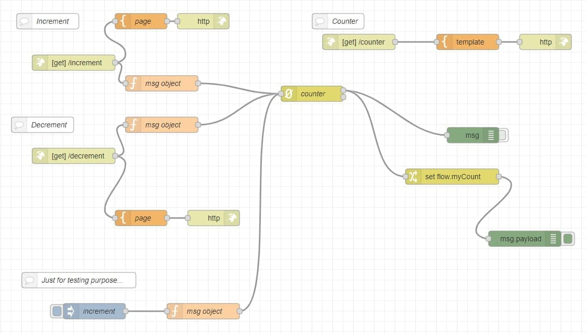

# QR Code system
The goal of this research topic is to find a way to track the number (and the id if possible) of the people in a room.

[[toc]]
## How it works?
My first idea was to use a pair of qr codes to track the people entering and exiting of the room.

So i made a Nodered app, hosted in 
[Heroku: Cloud Application Platform](https://www.heroku.com), that can accept three kind of http request:
- [/increment:](https://noderedtestgixs.herokuapp.com/increment) to increment the counter of people in room;
- [/decrement:](https://noderedtestgixs.herokuapp.com/decrement) to decrement the counter;
- [/counter:](https://noderedtestgixs.herokuapp.com/counter) to get the actual counter value.

On each request is attached an qrcode:

|  |  |
| --------------------------- | --------------------------- |

Before entering in the room, the users need to scan the code; a counter, in the Nodered flow, will be updated. 
Before exiting, the users need to scan the code; **in this way we have in realtime the number of people staying in the room.**

### Nodered flows
The nodered flows is pushed on the repository and this is a screenshot of it:

The main node is the *counter* one; is an add-on palette called "*node-red-contrib-counter*".
Every http request on the right address increment and decrement the object.
After that, the value of the counter is setted as *flow* variable, and it's accessible in the */counter* http request.
We could also use this variable in different way. **Open to any ideas.**

### Qr code generation
I easily generated the _qr codes_ using [QR Code Generator](https://it.qr-code-generator.com/).

### Heroku deployment
For the deployment in heroku I just left clicked on the button below

gifted by @joertsea

> A wrapper for deploying Node-RED into the Heroku.
> https://elements.heroku.com/buttons/joeartsea/node-red-heroku

## Next step
### One qr code system for each room
The next few things to do is to interface the system with the multiple room management, so that we have 2 qr code for each room (1 to enter and 1 to exit).

The idea is to create an http request for each room and this is can be done in two different way:
1. Different request for each room: /enteringRoom1 /exitingRoom1, /enteringRoom2 and so on...
2. Change a little bit the Nodered code in order to have a better management of the room: for istance we can have request like /entering/[**room id*]

## Future ideas
### Track people by telegram nickname
A good idea for a possible implementation (if we have time to spend on it.)  is through telegram.

In the http request we could insert:
- **State**: entering or exiting;
- **Room**: the room id;
- **Telegram nickname**: the telegram nickname of the person that's is using the service.

In this way we can both track the number of the user and also has a way of comunication with them.

The first request will be to subscribe to a telegram bot and the next request will be automatically processed. 

In case of the allarm, so if in the room there are too much people, they will be advised by the telegram bot and they **hopefully** leave the room.